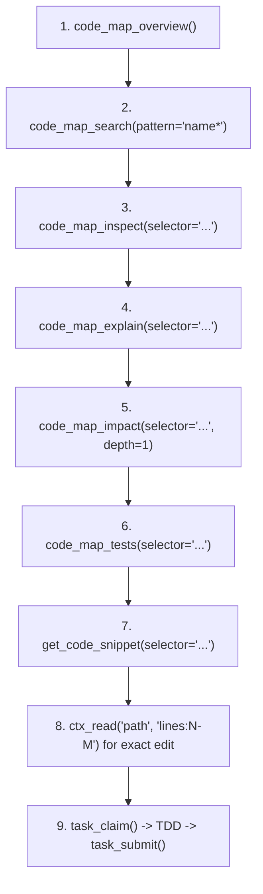

# ContextUnity Forge MCP

`contextunity-forge` provides high-performance semantic code-graph querying, architectural inspection, and impact analysis for repositories indexed by Forge.

## Core Operational Boundaries

- **SQLite Timeout**: 2.0 seconds per query. Unbounded queries fail fast.
- **Output Limit**: Responses capped at 64 KiB.
- **Pagination**: Default page size is 30 items (max 100).
- **Continuation**: When `next_offset` > 0, you **must** supply `offset=next_offset` AND `generation="<token>"` from the previous page to continue pagination.
- **Detail Mode**: Use `detail="compact"` on broad queries to avoid payload overflow. Use `detail="full"` only when inspecting single entities.
- **Budget Recovery**: If a query times out or exceeds budget, **do not just lower `limit`**. You must narrow `selector`/`path` or reduce `depth` (e.g., `depth=1`).

---

## Canonical Discovery Workflow

Follow this sequence to orient, navigate, and execute tasks:



1. **Orient**: `code_map_overview()`
   - Verify `workspace_root` matches the active worktree.
   - Check indexed coverage and components before making claims about absence.
2. **Locate**: `code_map_search(pattern="Token*", detail="compact")`
   - Use prefix wildcard (`prefix*`) or full-text terms.
   - Retrieves matching symbols with kinds, paths, and fully-qualified selectors.
3. **Inspect**: `code_map_inspect(selector="function:...")`
   - Reads exact definition, signature, docstring, and declared architectural invariants.
4. **Relate**: `code_map_explain(selector="...")`
   - Unveils symbol ownership, direct callers (inbound), callees (outbound), and invariants.
5. **Blast Radius**: `code_map_impact(selector="...", depth=1)`
   - Traces inbound dependency chains before modifying or removing symbols.
   - Keep `depth=1` initially to avoid combinatorial explosions.
6. **Tests**: `code_map_tests(selector="...", direction="inbound")`
   - Identifies which tests exercise the target code (`inbound`), or what production code a test relies on (`outbound`).
   - Narrow symbols only; broad modules will be rejected.
7. **AST Preview**: `get_code_snippet(selector="...")`
   - Reads a bounded window (5 leading + 35 body lines) directly from the AST.
8. **Verify Source**: Use `ctx_read` for exact source ranges before editing.
9. **Task Lifecycle**: Claim, execute, and submit tasks via the operational task tools.

---

## Tool Reference (19 Tools)

### Operational Task Lifecycle
- `task_list(status?, milestone?, owner?, limit?)`: Query executable tasks in SQLite store (defaults strictly to `status: "ready"`).
- `task_claim(task_id, stage, worker_id, worktree)`: Claim an operational task gate in the assigned worktree.
- `task_submit(task_id, stage, action, evidence_ref?, findings?)`: Submit validation evidence or review findings to pass/reject the active gate.
- `task_manage(action, task_id?, reason?)`: Task state administration (`inspect`, `cancel`, `release_worker`, `archive`).


### Discovery & Search
- `code_map_overview()`: Workspace component list, module hierarchy, indexing stats, and unresolved edges.
- `code_map_search(pattern, kind?, detail?, limit?, offset?, generation?)`: Fast FTS and prefix symbol lookup.
- `ast_grep_search(pattern, language, path?, limit?, offset?, generation?)`: Tree-sitter AST syntax matching with `$NAME` and `$$$ARGS` captures.
- `search_docs(query, doc_type?, component?, limit?)`: Full-text search across documentation and ADRs.
- `get_doc(path_or_id, section?)`: Reads markdown doc or a specific section anchor.

### Inspection & Hierarchy
- `code_map_inspect(selector, include_coverage?, show_doc?, show_source?, leading_lines?, max_body_lines?)`: Symbol summary and direct relationships. Request `include_coverage=true` for raw reference diagnostics.
- `get_code_snippet(selector, leading_lines?, max_body_lines?, source_offset?, generation?)`: Focused AST source preview.
- `code_map_explain(selector, direction?, include_coverage?, show_doc?, show_source?)`: Symbol summary, ownership, and direct edge relations. Raw reference diagnostics are opt-in.
- `code_map_impact(selector, direction?, depth?, detail?, limit?, offset?, generation?)`: Use `direction="inbound"` for blast radius (default) or `direction="outbound"` for dependencies.
- `code_map_tests(selector, direction?, detail?, limit?, offset?, generation?)`: Inbound tests or outbound test dependencies.

### Verification & Safety
- `code_map_prove_removal(selector)`: Verifies if a symbol or module can be safely deleted without broken references.
- `code_map_analyze(target, include_cycles?)`:
  - `target=""`: Workspace-wide diagnostic and error summary.
  - `target="path/to/file.py"`: Paged diagnostics for a specific file.
  - `include_cycles=true`: Computes dependency cycles.
  - Read-only SQL: Run `SELECT ...` queries against index SQLite tables.
- `code_map_query(operation, selector?, include_coverage?, depth?, limit?, offset?, generation?)`: Use `slice` or `unwired` for bounded graph queries. Request `include_coverage=true` with `inspect` or `explain` for raw reference diagnostics. Use `operation="sql"` and a single read-only `SELECT`/`WITH` statement in `selector` for relational queries; request deterministic ordering and pass page bounds as tool arguments. Read schema guidance with `forge_guide`.
- `session_checkpoint(action, name?, content?)`: Workspace checkpointing in `.forge/checkpoints.json` (`list`, `get`, `save`, `delete`).
- `forge_guide(topic?, force?)`: Interactive guide (defaults to `query`).

---

## Resilient Selectors & Query Resolution

Forge provides intelligent, collision-free selector resolution across all tools (`inspect`, `impact`, `explain`, `tests`, `prove_removal`, `snippet`):
- **Exact ID**: Canonical node IDs (`function:src/scanner.rs:42:scan`, `class:...`, `module:...`) always take precedence and resolve in 1 step.
- **File Paths**: Passing a file path (e.g. `src/scanner.rs` or `packages/core/types.py`) automatically and safely selects the module node rather than erroring with ambiguity. Strips `file://`, `file:`, and `./` automatically.
- **Path + Symbol**: `src/scanner.rs:scan` or `src/scanner.rs::scan` resolves directly to the inner function/class inside that file, filtering out the module itself.
- **Path + Line Coordinates**: `src/scanner.rs:42` or `src/scanner.rs#L42` automatically resolves to the innermost AST symbol (function/class/method) spanning that line.
- **Bare Name Safety (No Hijacking)**: When a bare name (e.g. `scanner`) matches both a function and a module of the same name, Forge **never** hijacks the symbol into a module. It safely reports ambiguity with exact candidate IDs.
- **Suffix Matching**: Resolves Python import paths (e.g. `contextunity.shield.cli`), class methods (`FormLoginFetcher.fetch`), and relative subpaths.
- **Documentation Detection**: Selectors ending in `.md` (e.g. `docs/architecture.md`) return a direct pointer to use `get_doc` or `search_docs`.
- **SQL in `code_map_query`**: Query `nodes`, `edges`, `files`, `errors`, and documented relational views through `operation="sql"`; writes, administrative statements, and multiple statements are rejected.

---

## Linked Workspaces (`forge-mcp.yaml`)

To index sibling or dependent worktrees into a single unified code graph:
```yaml
roots:
  - src
linked_workspaces:
  - name: shared-contracts
    path: "../shared-contracts"
    enabled: true     # Set to false to disable without removing the block
    roots:
      - src
  - name: extra-library
    path: "../extra-library"
    enabled: false    # Toggle off to skip indexing this worktree
```
When `enabled` is omitted, it defaults to `true`. Modifying `enabled` triggers automatic rebuild/reindex of the code graph on next read.

---

## Ground Truth & Source Verification
- Forge provides structural intelligence from the indexed code graph.
- Always verify material claims in exact source using `ctx_read`.
- Check `code_map_overview` coverage metrics before asserting that a function or class does not exist.
