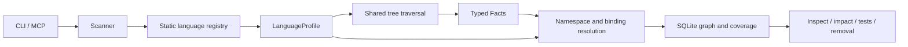

# Language profiles and import identity

## Pipeline and ownership



`src/engine/languages` owns language policy. `build.rs` discovers profile files and generates the registry. It exposes
immutable profiles; grammar/parser selection happens at file boundaries. Parsers remain
local mutable values and are never shared across workers. Dispatch through a
trait is not literally zero overhead; caller-path measurements compare actual
release binaries.

The shared AST layer owns traversal, symbol identity bookkeeping and reusable
syntax operations. Profiles choose applicable operations and supply language
syntax rules. The linker owns candidate selection and ambiguity; profiles own
module spelling, relative import conventions and language compatibility.
The writer owns both full persistence and incremental invalidation.

| Profile responsibility | Examples |
| --- | --- |
| Admission and grammar | Extensions, TS versus TSX, fallible parser creation |
| Symbols and metadata | Syntax kinds, public ID prefixes, docstrings/comments, receivers, test attributes |
| References and relations | Import aliases, calls, inheritance, implementations, decorators, mutation and routes |
| Binding semantics | Value versus method namespaces, local shadowing, receiver identity |
| Module conventions | Python `__init__`, JS/TS `index`, Rust `mod`; relative imports |
| File preparation and completion | Default exports prepared once, implicit fields, Vue script blocks |
| Builtins and structural patterns | Language builtins, context checks, Python partial-body search patterns |

## Exact imports require a complete identity

An identical last name does not identify a dependency. A module at
`[commerce]/package/settings.py` does not satisfy `from settings import value`.
A complete qualified import such as `commerce.snapshot` can identify
`[commerce]/commerce/snapshot.py` when the namespace has one admissible provider.
Relative imports remain within their owning workspace. Symbol candidates must
belong to the selected module and compatible language family.
Owner-workspace namespace alternatives are considered before linked providers,
including Rust inline modules represented inside a parent module file.

Missing or ambiguous imports remain visible in resolution coverage. A known
external import has status `external` when no indexed provider matches: Rust
`std::`, `core::` and `alloc::` paths and explicit JavaScript/TypeScript `node:`
paths have this classification. Unknown absolute imports stay `unresolved` with
evidence that the provider may be external or missing. An `external` import has
no invented graph edge; calls through it can still be unresolved. Overview and
analysis count known external imports separately from unresolved references.
Discovery by suffix is insufficient evidence for an exact dependency. Names of
standard library methods alone are also insufficient: the caller may use a
user-defined object, local binding or imported alias.

Adapter scan roots describe which paths enter the index. They do not declare
runtime import roots or compiler package mappings. Resolving `src` layouts,
package exports, build tags or dependency manifests requires additional explicit
language semantics; arbitrary prefix stripping cannot establish them.

## Automatic registration

Every top-level `.rs` file in `src/engine/languages`, except `mod.rs`, is a profile
provider. Shared support lives in subdirectories. Each provider exports
`pub static PROFILES: &[&dyn LanguageProfile]`; a provider can expose several
related modes, as the TypeScript provider does for TypeScript and JavaScript.

`build.rs` sorts provider filenames, selects enabled `lang-<filename>` Cargo
features and emits module declarations and registry groups into `OUT_DIR`.
Cargo watches the directory for additions and removals.
A new provider requires no manual registry or family-enum edit. Invalid provider
contracts fail the build; duplicate IDs and extensions are explicitly checked.
The query path uses the compiled registry without scanning directories or
loading executable plugins.

The compiled profile fingerprint is part of index semantics. It covers the
profile sources, shared profile support, `Cargo.lock` and the enabled provider
set. Changes invalidate
persisted analysis even when project source files are unchanged. CLI readers reject incompatible indexes; MCP rebuilds
an owned database through its existing workspace-admission checks.

## Adding a language

1. Add a profile provider in `src/engine/languages/<name>.rs` and export its
   `PROFILES` slice. Use a valid Rust module filename.
2. Implement grammar creation, extensions, symbol mapping and supported semantic
   hooks. `java.rs` demonstrates named declarations; `c.rs` demonstrates nested
   declarators. Defaults represent unsupported capabilities.
3. Declare `lang-<name>` in `Cargo.toml`, with an optional grammar dependency
   when needed, and add the feature to `all-languages`. Update `Cargo.lock` for
   new dependencies. Keep a compatible Tree-sitter runtime.
4. Rebuild with `--features lang-<name>`. The enabled provider is discovered
   automatically; no central Rust registry edit is required.
5. Add a production-path fixture covering extraction, persisted queries,
   unsupported/ambiguous references and `delta` versus a clean rebuild.
6. Run the verification commands below. Include generated-module source files
   explicitly in formatting checks:

```sh
cargo fmt --all -- --check src/engine/languages/*.rs
cargo test --locked --all-targets
cargo test --locked --all-targets --all-features
cargo clippy --locked --all-targets -- -D warnings
```

The registry is compiled into the binary. Adding a file requires a rebuild; it
is not runtime plugin installation. Profile source changes invalidate their
persisted results automatically. Changes in shared non-profile extraction or
linking semantics still require the base semantic-version policy.

## Supported source profiles

The default build enables Python, Rust, TypeScript/JavaScript, Vue and Proto.
Go, Java, C#, Kotlin, PHP, Ruby, C and C++ are optional. Vue enables the
TypeScript/JavaScript provider; C++ does not enable the C grammar. Disabled
extensions are outside the admitted inventory. An explicitly requested disabled
mode reports the required Cargo feature and the compiled profile IDs.

```sh
# Default project languages.
cargo build --release --locked
# Add Go to the default languages.
cargo build --release --locked --features lang-go
# Build only Rust, or the complete language set.
cargo build --release --locked --no-default-features --features lang-rust
cargo build --release --locked --features all-languages
# Markdown/document engine without source-language grammars.
cargo build --release --locked --no-default-features
```

These commands produce `target/release/contextunity-forge-mcp`. Features select
compiled capabilities; an adapter cannot enable an absent grammar. Switching
the compiled provider set invalidates existing index semantics.

| Profile ID | Extensions | Static-analysis boundary |
| --- | --- | --- |
| `python` | `.py`, `.pyi` | Lexical imports, functions/classes, decorators and Python receivers; dynamic receiver types remain unknown |
| `typescript` | `.ts`, `.tsx` | TypeScript/TSX grammar, symbols, imports, inheritance and routes; no compiler type inference |
| `javascript` | `.js`, `.jsx` | JavaScript/JSX grammar with shared ECMAScript extraction; dynamic imports remain conservative |
| `vue` | `.vue` | Script blocks with absolute source coordinates and basic template bindings; styles and complex expressions remain outside extraction |
| `rust` | `.rs` | Syntax, imports, traits/implementations and test attributes; macro expansion and Cargo configuration are not compiler-resolved |
| `go` | `.go` | Declarations, local calls and same-package sibling function links; build tags and external test packages remain unmodeled |
| `proto` | `.proto` | Messages, enums, services and RPC type references; broader package/public-import resolution remains limited |
| `java` | `.java` | Declarations, local calls and inheritance; classpath imports and overload/type resolution are conservative |
| `csharp` | `.cs` | Declarations, local calls and base relations; assembly/namespace imports and dynamic dispatch are conservative |
| `kotlin` | `.kt`, `.kts` | Declarations, local calls and base relations; classpath imports, extensions and inferred receiver types are conservative |
| `php` | `.php` | PHP grammar, declarations, grouped import paths and supported calls/relations; autoload and dynamic dispatch remain unresolved |
| `ruby` | `.rb` | Declarations and supported calls; bare identifiers and metaprogramming can invoke code without explicit call syntax |
| `c` | `.c`, `.h` | Declarations, local calls and include facts; preprocessing and function-pointer targets require additional evidence |
| `cpp` | `.cpp`, `.cc`, `.cxx`, `.hpp`, `.hh`, `.hxx` | Declarations, local calls and supported bases; preprocessing, templates and implicit/operator calls remain conservative |

`.h` selects C. Use a C++ header extension for C++ syntax. Markdown/MDX use the
separate document pipeline. A successfully parsed file does not establish that
all of its runtime dependencies are statically resolved.

## Adapter boundary

Adapters configure inventory roots, exclusions and linked workspaces. They do
not currently override profiles or inject language rules. A bounded future
extension can declare file-to-profile selection, explicit import roots/package
aliases and named framework capabilities. Such configuration needs validation
and index invalidation; arbitrary executable rules are outside this boundary.

## Verification

Collision fixtures cover foreign suffix matches, compatible and incompatible
languages, owner-local precedence, relative imports and qualified linked
packages. Incremental checks compare persisted edges and resolution evidence
with a clean rebuild after provider changes.

Release comparisons retain a baseline executable and use identical generated
corpora, four Rayon threads, one warmup and five alternating samples. The
fixture includes both many small files and one large TypeScript file. Measured
medians describe the fixture and host, not universal performance guarantees.
