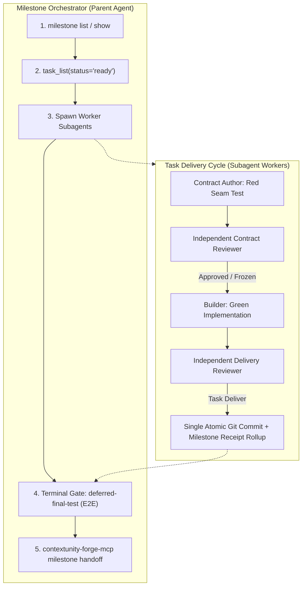

# Admitted-Contract-Driven Development (ACDD) Execution Runbook

ACDD is the deterministic delivery engine for ContextUnity repositories. It enforces peer-reviewed technical contracts, independent verification, and strict context hygiene across AI subagents.

---

## 1. Core Architecture: Macro vs Micro Lifecycle

ACDD maintains a strict separation between milestone-level orchestration and task-level execution:

| Level | Scope & Ownership | State Store | Completion Term |
| :--- | :--- | :--- | :--- |
| **Milestone** (Macro) | Whole feature capability owned by the Parent Orchestrator | Git Markdown (`docs/milestones/*.md`) | **`handoff`** (`milestone handoff`) |
| **Task** (Micro) | Isolated work unit owned by ephemeral Worker Subagents | SQLite (`tasks.sqlite` & Task Blackboard) | **`deliver`** (`task_submit stage='deliver/v1'`) |



---

## 2. Single Atomic Commit Law (Git Hygiene)

> [!IMPORTANT]
> **1 Task = 1 Atomic Git Commit.**
> Keep production code, tests, and task receipt unified within a single atomic commit.

When a task reaches completion, the delivery agent stages and commits all changes together in one atomic commit:
1. The production code implementation (`src/...`);
2. The contract and seam tests (`tests/...`);
3. The updated milestone Markdown task receipt (`docs/milestones/*.md`).

**Canonical Commit Formats**:
- Task feature: `feat(<scope>): <concise task summary>`
- Task bugfix: `fix(<scope>): <concise defect resolution>`
- Milestone final test: `test(milestone): deferred-final-test prove invariants`
- Milestone archival: `docs(milestone): archive completed milestone <id>`

This guarantees an unbroken, strictly linear Git log where every commit builds, passes all tests, and self-documents its own verified receipt without messy merge bubbles.

---

## 3. Task Execution: 4 Autonomous Roles

Inside a task, subagents communicate asynchronously through the SQLite **Task Blackboard** (`task_blackboard`), preventing conversational context bloat and token exhaustion.

### Role 1: Contract Author
- **When invoked**: Upon `task_claim(stage="contract/v1")`.
- **Context ceiling**: Clean prompt (< 10k tokens).
- **Actions**:
  1. Inspect the task's `target`, `scope`, and declared `invariants` from `task_claim`.
  2. Author a failing **red seam-test** in `tests/` asserting observable external behavior.
  3. Execute the test: verify it fails with the expected failure mode (e.g. exit code 101 or assert error).
  4. Post the contract draft and test command to the task blackboard:
     `topic: "contract_draft"`, payload containing test command, expected red status, and touched scopes.
  5. Conclude turn and await independent contract review before implementation.

### Role 2: Independent Contract Reviewer (Anti-Hallucination Gate)
- **When invoked**: Immediately after Contract Author posts to Blackboard.
- **Invariance**: Must be an independent subagent (`worker_id != contract_author`).
- **Actions**:
  1. Read `task_blackboard` for topic `contract_draft`.
  2. Validate the proposed contract against live source, configuration, and governing ADRs:
     - Detect hallucinations (invented types, invalid CLI flags, non-existent endpoints);
     - Detect artificial self-justifying tests (see Section 4 for Anti-Mock rules);
     - Verify `allowed_write_scope` covers only required paths.
  3. **Verdict**:
     - *If flaws found*: Post findings to blackboard topic `contract_findings` (author gets one repair pass).
     - *If verified*: Advance task gate: `task_submit(task_id, stage="contract/v1", action="pass")`.
     The contract is now cryptographically frozen (`contract_revision`).

### Role 3: Builder
- **When invoked**: Upon `task_claim(stage="build/v1")`.
- **Context ceiling**: Clean prompt (< 10k tokens).
- **Actions**:
  1. Read the frozen contract from `task_blackboard` (topic `contract_draft`).
  2. Author production code strictly within `allowed_write_scope`.
  3. Run the contract seam-test until it turns green.
  4. Post build readiness to blackboard: `topic: "build_proof"` with commit candidate and test results.

### Role 4: Independent Delivery Reviewer
- **When invoked**: Upon `task_claim(stage="deliver/v1")`.
- **Invariance**: Must be independent (`worker_id != builder`).
- **Actions**:
  1. Inspect the complete candidate Git diff against the frozen contract.
  2. Execute verification commands:
     - `cargo clippy --all-targets --all-features -- -D warnings`
     - Targeted task test: `cargo test --test <suite> <test_name>`
     - Commitment integrity: `cargo test --test commitment_integrity`
  3. Verify the 5 standard review contours:
     - `paths`: edits strictly within scope;
     - `claims`: target requirements met without speculative extras;
     - `concurrency`: thread safety and transaction boundaries respected;
     - `project_isolation`: no cross-project leaks;
     - `administration`: configuration defaults and schema integrity preserved.
  4. Create the **Single Atomic Git Commit** (code + tests + updated task receipt in milestone).
  5. Submit delivery: `task_submit(task_id, stage="deliver/v1", action="pass", evidence={...})`.
     The engine automatically rolls up the receipt into SQLite and purges ephemeral blackboard entries.

---

## 4. Test Quality & Structure Rules

Extracted from repository test invariants and test suite architecture:

1. **Observable External Seams Over Mock Assertions**:
   Tests must enter through supported public seams (CLI binary, SQLite store, engine API) and assert observable durable state or real return values.
2. **Positive Specification Coverage**:
   Tests must prove observable positive specifications, formal boundary conditions, or verified fail-closed rejections.
3. **Table-Driven Tests Over Function Duplication**:
   When testing boundary values, input permutations, or error mappings, iterate over structured data tables (`for case in cases { ... }`) instead of copy-pasting dozens of nearly identical test functions.
4. **Shared Test Harnesses Over Repeated Boilerplate**:
   Common test setups (creating temporary SQLite stores, sample worktree layouts, test configurations) must live in shared test helpers (e.g. `tests/common/`) rather than repeating 40 lines of initialization boilerplate inside every single test.
5. **Domain Cohesion (Unified Domain Modules)**:
   Keep coherent test suites unified within their subsystem domain (`tests/core_basics/tasks.rs`, `tests/manifests.rs`). Split tests strictly along natural architectural sub-boundaries when distinct domains emerge.

---

## 5. Task Blackboard Protocol

The Task Blackboard in SQLite (`task_blackboard`) provides token-lean asynchronous coordination between subagents. Task specifications (`target`, `scope`, `invariants`) are already persisted in `tasks.sqlite` and returned by `task_claim`, so the blackboard is strictly reserved for live agent collaboration.

### Standard Blackboard Topics
| Topic | Author | Purpose |
| :--- | :--- | :--- |
| `contract_draft` | Contract Author | Red test path, exact test command, expected red error, proposed signatures |
| `contract_findings` | Contract Reviewer | Rejection rationale and required contract adjustments |
| `build_proof` | Builder | Candidate commit SHA, green test output, clippy status |
| `architectural_notes` | Any Worker | Non-obvious trade-offs or decisions to be rolled up to milestone receipt |

### Clean Collaboration Flow
1. **Contract Author**: reads task spec from `task_claim`, writes failing seam-test, posts `contract_draft`.
2. **Independent Contract Reviewer**: reads `contract_draft`, runs test command to verify red, checks against ADRs. If approved -> calls `task_submit(stage="contract/v1", action="pass")`.
3. **Builder**: reads approved `contract_draft`, writes green code, posts `build_proof` with commit candidate.
4. **Independent Delivery Reviewer**: reads `build_proof`, runs clippy and full tests, creates the Single Atomic Commit (code + tests + milestone receipt), and calls `task_submit(stage="deliver/v1", action="pass")`.
5. **Automatic Cleanup**: Upon delivery approval, the engine automatically rolls up `architectural_notes`, commit SHA, and test proofs into the milestone receipt, and calls `blackboard_clear(task_id)` to purge ephemeral scratchpad data.

---

## 6. Milestone Terminal Gate & Documentation Alignment

When all tasks in a milestone reach `completed` status in SQLite, the Orchestrator executes the Terminal Verification Gate and Documentation Alignment before calling `milestone handoff`:

1. **Spawn Milestone Verifier Subagent**:
   - `Role: "Milestone Verifier"`
   - `Model: "pro"` or prescribed `agent_type`
2. **Execute `deferred-final-test`**:
   - The verifier enters from the perspective of an external consumer (CLI invocation, full pipeline read).
   - Proves all declared milestone `invariants:` across all merged task changes.
   - Tests through real public callers, live SQLite connections, and genuine engine collaborators.
3. **Align Milestone Documentation**:
   - Review and update canonical documentation (`docs/reference/`, `docs/architecture/`, `docs/runbooks/`, and `AGENTS.md`) reflecting all new or changed CLI commands, MCP tools, configuration parameters, or schema changes introduced by the milestone.
   - Verify internal markdown links and cross-references.
   - Ensure new tools and workflows are documented in `README.md` and reference guides.
4. **Commit Verification and Documentation**:
   - Commit the end-to-end tests and documentation updates as clean atomic commits:
     `test(milestone): deferred-final-test prove invariants`
     `docs(milestone): align reference and runbooks for milestone <id>`
5. **Trigger Milestone Handoff**:
   - Run CLI: `contextunity-forge-mcp milestone handoff <id> --evidence "cargo test --all-targets"`
   - Computes development duration, formats `handoff:` block, marks `status: completed`, and moves file to `docs/milestones/archive/`.

---

## 7. Configuration & Missing Guidance Fallback

Configure the canonical guidance path in `forge-mcp.yaml`:

```yaml
tasks_db: .forge/tasks.sqlite
task_repository: forge-mcp
task_project: forge-mcp
agents_guidance: docs/runbooks/acdd.md
```

### Missing Guidance Fallback Protocol
If `agents_guidance` is unconfigured and `AGENTS.md` is absent:
1. Forge MCP returns a structured warning in `workflow_guidance.warning`.
2. Emits an inline 3-step default procedure (Contract -> Build -> Independent Review).
3. Links to the canonical reference: `https://github.com/ContextUnity/contextunity-forge-mcp/blob/main/docs/runbooks/acdd.md`.
