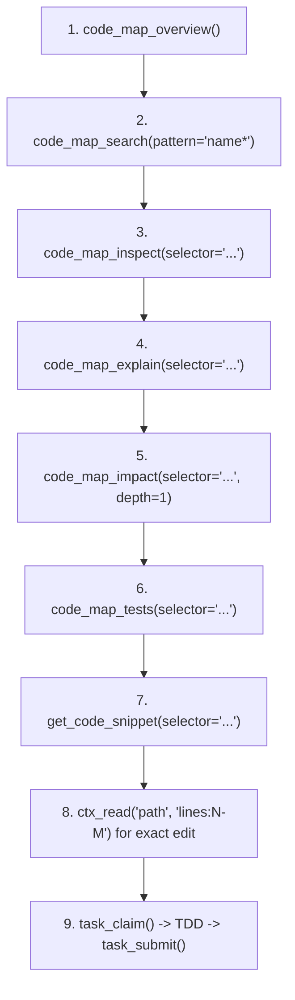

# ContextUnity Forge MCP

`contextunity-forge` provides high-performance semantic code-graph querying, architectural inspection, impact analysis, and **ACDD (Admitted-Contract-Driven Development)** task coordination for repositories indexed by Forge.

## MCP & CLI Dual-Surface Binding

Use the registered Forge MCP tools or CLI (`contextunity-forge-mcp`) for symbols, callers, dependencies, impact, and task lifecycle operations:
- Both interfaces share 100% functional parity.
- The server may be named `contextunity-forge` or `forge-mcp`; use the active registry and tool schemas.
- Start with `code_map_overview` to verify the active workspace, components, and indexing coverage.
- Hot reload: On Unix, `contextunity-forge-mcp reload` sends `SIGHUP` to running servers, replacing the executable in-place without breaking client connections.

## Core Operational Boundaries

- **SQLite Timeout**: 2.0 seconds per query. Unbounded queries fail fast.
- **Output Limit**: Responses capped at 64 KiB.
- **Pagination**: Default page size is 30 items (max 100).
- **Continuation**: When `next_offset` > 0, supply `offset=next_offset` AND `generation="<token>"` from the previous page to continue.
- **Detail Mode**: Use `detail="compact"` on broad queries to avoid payload overflow. Use `detail="full"` only when inspecting single entities.
- **Budget Recovery**: If a query times out or exceeds budget, narrow `selector`/`path` or reduce `depth` (e.g., `depth=1`).

---

## Canonical Discovery Workflow



1. **Orient**: `code_map_overview()`
   - Verify `workspace_root` matches the active worktree.
   - Check indexed coverage and components before making claims about absence.
2. **Locate**: `code_map_search(pattern="Token*", detail="compact")`
   - Use prefix wildcard (`prefix*`) or full-text terms.
   - Retrieves matching symbols with kinds, paths, and fully-qualified selectors.
3. **Inspect**: `code_map_inspect(selector="function:...")`
   - Reads exact definition, signature, docstring, and declared architectural invariants.
4. **Relate**: `code_map_explain(selector="...")`
   - Unveils symbol ownership, direct callers (inbound), callees (outbound), and invariants.
5. **Blast Radius**: `code_map_impact(selector="...", depth=1)`
   - Traces inbound dependency chains before modifying or removing symbols.
   - Keep `depth=1` initially to avoid combinatorial explosions.
6. **Tests**: `code_map_tests(selector="...", direction="inbound")`
   - Identifies which tests exercise the target code (`inbound`), or what production code a test relies on (`outbound`).
7. **AST Preview**: `get_code_snippet(selector="...")`
   - Reads a bounded window (5 leading + 35 body lines) directly from the AST.
8. **Verify Source**: Use `ctx_read` for exact source ranges before editing.
9. **Task Lifecycle**: Claim, execute, and submit tasks via ACDD gates.

---

## ACDD (Admitted-Contract-Driven Development) & Tasks

ACDD connects Git milestone contracts (`docs/milestones/*.md`) to an executable, deterministic task queue in SQLite (`.forge/tasks.sqlite`). Code index rebuilds never reset task state.

### The 4 Verification Gates
Each task advances sequentially through four gates:
1. `contract/v1`:
   - Greenfield / Bug fix (`seam-test-first`): Claim gate, create failing red seam test, submit proof with non-zero exit code.
   - Existing code / refactoring (`direct-proof`): Validate existing seam directly; exit code 0 accepted.
2. `build/v1`: Implement changes, verify green passing tests, submit passing exit code proof.
3. `review/v1`: Independent audit across 5 contours (`paths`, `claims`, `concurrency`, `project_isolation`, `administration`).
   - **Worker Separation Rule**: The reviewer's `worker_id` MUST differ from the accepted builder.
4. `deliver/v1`: Delivery worker (different from builder) writes durable snapshot-backed receipt into SQLite and milestone Markdown, then clears task blackboard.

### Scope Boundaries & `scope_roots`
- Tasks define `scope` (target files) and optional `scope_roots` (allowed directory trees).
- Modifications are restricted to the task's admitted scope.
- Extending scope (`task_manage action=extend_scope` or `contextunity-forge-mcp task extend-scope`) requires explicit ownership. If a path falls outside `scope_roots`, `contract_revision` must be bumped in the milestone spec before sync.

### Subtasks
- Subtasks allow iterative checklists, unit step tracking, and fine-grained discoveries without inflating the milestone task DAG or altering parent contract digests.
- Use `contextunity-forge-mcp task subtask add/update/list`.

### Temporary Memory: Task Blackboard
- Post and read transient collaboration messages across milestone, task, and subtask scopes.
- Canonical topics:
  - `contract_draft`: Red test path, command, failure output, proposed seam.
  - `contract_findings`: Unsupported assumptions and required repairs.
  - `build_proof`: Candidate SHA, focused test results, clippy status.
  - `architectural_notes`: Architectural decisions that survive delivery (auto-copied into task receipt).

### Closing a Milestone
- Once all tasks are delivered and committed, run full verification:
  ```bash
  contextunity-forge-mcp milestone handoff <id> \
    --verification-command "cargo test --all-targets" \
    --tests-passed <N> --tests-failed 0
  ```
- This writes the handoff receipt, seals Git commit SHAs, and moves the contract into `docs/milestones/archive/`.

---

## Workspace Adapters (`forge-mcp.yaml`) & Default Behavior

### Where Adapters Live
- Primary adapter: `forge-mcp.yaml` in the repository root.
- Linked adapters: sibling repositories configured under `linked_workspaces`.
- Starter file generation: `contextunity-forge-mcp guide init`.

### Connecting Adapters
```yaml
roots:
  - src
docs:
  - docs
milestones:
  - docs/milestones
plans:
  - docs/plans
ignore:
  - target
  - node_modules
linked_workspaces:
  - name: shared-core
    path: ../shared-core
    enabled: true
    roots:
      - src
    tasks:
      enabled: true
      repository: shared-core
      project: shared-core
      agents_guidance: AGENTS.md
tasks_db: .forge/tasks.sqlite
task_repository: forge-mcp
task_project: forge-mcp
agents_guidance: AGENTS.md
response:
  page_size: 30
  max_output_bytes: 65536
```

### Default Behavior (Without `forge-mcp.yaml`)
- **Code Graph**: Scans workspace root (`.`), respects `.gitignore`, excludes common build/cache folders (`target`, `node_modules`, `.git`, `.venv`, `__pycache__`), and outputs `.forge/code-map.sqlite`.
- **Tasks Database**: Defaults to `.forge/tasks.sqlite`.
- **Git Worktrees Auto-Resolution**: When operating inside a Git worktree, relative `tasks_db` paths automatically resolve to the primary worktree root (via `git rev-parse --git-common-dir`). All parallel worktree workers seamlessly coordinate on the single shared tasks database without configuration changes or absolute paths.
- **Identity Defaults**: `task_repository` and `task_project` default to `forge-mcp`; `agents_guidance` defaults to `AGENTS.md`; milestone directory defaults to `docs/milestones/`.

---

## Complete MCP Tool Matrix (20 Tools)

### Operational Task Lifecycle
- `task_list(repository?, milestone_ref?, milestone_status?, status?, stage?, detail?)`: Query task cards; defaults to ready tasks in active milestones.
- `task_claim(task_id, stage, worker_id, worktree, bundle?)`: Claim the current gate; returns stage-specific guidance and context bundles.
- `task_submit(task_id, stage, action, evidence, findings?)`: Submit claim-bound JSON proof or review findings.
- `task_manage`: Manage tasks via flat actions (`create`, `sync`, `inspect`, `context`, `delete`, `extend_scope`, `subtask_add`, `subtask_update`, `subtask_list`, `reset`, `reopen`).
- `task_blackboard`: Post/read/inspect ephemeral messages at `milestone`, `task`, or `subtask` scope.

### Discovery & Search
- `code_map_overview()`: Workspace component inventory, module hierarchy, indexing metrics, and coverage diagnostics.
- `code_map_search(pattern, kind?, detail?, limit?, offset?, generation?)`: Fast BM25 full-text and prefix symbol search.
- `ast_grep_search(pattern, language, path?, limit?, offset?, generation?)`: Tree-sitter AST syntax matching with `$NAME` and `$$$ARGS` captures.
- `search_docs(query, doc_type?, component?, limit?)`: Full-text search across documentation, guides, and ADRs.
- `get_doc(path_or_id, section?)`: Read indexed markdown doc or exact heading anchor.

### Inspection & Hierarchy
- `code_map_inspect(selector, include_coverage?, show_doc?, show_source?, leading_lines?, max_body_lines?)`: Symbol summary, receiver metadata, callers, and callees.
- `get_code_snippet(selector, leading_lines?, max_body_lines?, source_offset?, generation?)`: Bounded, digest-verified AST source preview.
- `code_map_explain(selector, direction?, include_coverage?, show_doc?, show_source?)`: Direct relationships, symbol ownership, and architectural invariants.
- `code_map_impact(selector, direction?, depth?, detail?, limit?, offset?, generation?)`: Inbound blast radius (`direction="inbound"`, default) or outbound dependencies.
- `code_map_tests(selector, direction?, detail?, limit?, offset?, generation?)`: Find tests covering a target, or production dependencies of a test.

### Verification & Safety
- `code_map_prove_removal(selector)`: Proves whether a symbol can be safely removed based on static references.
- `code_map_analyze(target, lint?, include_cycles?)`:
  - `target=""`: Workspace-wide diagnostics and syntax errors.
  - `target="path/to/file.py"`: File-scoped diagnostics.
  - `lint=true`: Returns stored AST parse and syntax errors.
  - `include_cycles=true`: Detects dependency cycles.
- `code_map_query(operation, selector?, include_coverage?, depth?, limit?, offset?, generation?)`: Graph slices, unwired nodes, or read-only SQL (`operation="sql"`).
- `session_checkpoint(action, name?, content?)`: Manage workflow checkpoints in `.forge/checkpoints.json`.
- `forge_guide(topic?, force?)`: Interactive guidance (`topic="acdd"`, `"query"`, `"adapter"`, `"docs"`, `"ast"`).

---

## Resilient Selectors & Query Resolution

- **Exact ID**: Canonical node IDs (`function:src/scanner.rs:42:scan`, `class:...`, `module:...`).
- **File Paths**: `src/scanner.rs` automatically selects the module node. Strips `file://`, `file:`, and `./`.
- **Path + Symbol**: `src/scanner.rs:scan` resolves directly to the inner symbol inside the file.
- **Path + Line Coordinates**: `src/scanner.rs:42` or `src/scanner.rs#L42` resolves to the innermost AST node spanning that line.
- **Bare Names**: Reported with candidate IDs when ambiguous; never hijacked into modules.
- **Documentation**: Selectors ending in `.md` automatically direct agents to `get_doc` or `search_docs`.
