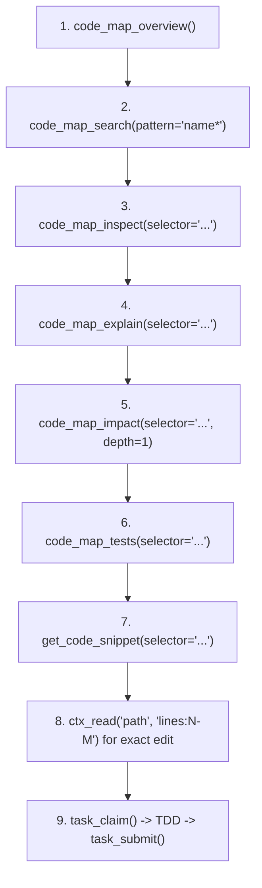

# ContextUnity Forge MCP

`contextunity-forge` provides high-performance semantic code-graph querying, architectural inspection, impact analysis, and **ACDD (Augmented Contract-Driven Development)** task coordination for repositories indexed by Forge.

## Documentation layers

Every indexed repository uses these roles. Create a directory only when it has pages. A page states current behavior or a command.

| Path | Contains |
| --- | --- |
| `docs/AGENTS.md` | Authoring rules for that tree |
| `docs/README.md` | Navigation |
| `docs/roadmap.md` | One or two strategic paragraphs |
| `docs/architecture/` | Current system topology |
| `docs/adr/` | Accepted decisions |
| `docs/reference/` | Interfaces: configuration, CLI, tools, and schemas |
| `docs/runbooks/` | Commands and operational sequence for that repository |
| `docs/testing/` | How that repository verifies |
| `docs/milestones/` | Admitted commitments. `archive/` keeps receipts |
| `docs/plans/` | Proposals before admission |
| `docs/archive/` | Retained history outside the documentation index |

The repository `AGENTS.md` names the verification command and the Git permission. The Forge binary's schemas stay in the Forge repository's `docs/reference/`. Indexer markup for pages Forge searches is in the Forge repository's `docs/AGENTS.md`.

## Forge MCP Server & CLI Dual-Surface Binding

> **CRITICAL DIRECTIVE**: Agents **MUST** use registered `contextunity-forge-mcp` MCP tools as the primary mechanism for code discovery, architecture inspection, documentation search, and task lifecycle operations whenever the server is active. Do NOT fallback to ad-hoc scripts or raw `grep` for code discovery unless Forge is unavailable.

- **MCP & CLI Dual-Surface**: Use registered Forge MCP tools or the CLI (`contextunity-forge-mcp`) on the surface providing the required operation.
- **Server Identity**: The MCP server is typically registered as `contextunity-forge` or `contextunity-forge-mcp`; use the active registry and tool schemas.
- **Repository Setup**: Repositories declare tool routing using the canonical template in [references/agents.md.example](references/agents.md.example).
- **CLI-Only Operations**: Milestone lifecycle commands (`milestone init/list/show/handoff`) are intentionally CLI-only.
- **Session Kickoff**: Start with `code_map_overview()` to verify active workspace, components, and indexing coverage.
- **Hot Reload**: On Unix, `contextunity-forge-mcp reload` sends `SIGHUP` to running servers, replacing the executable in-place without breaking client connections.

## Core Operational Boundaries

- **SQLite Timeout**: 2.0 seconds per query. Unbounded queries fail fast.
- **Output Limit**: Responses capped at 64 KiB.
- **Pagination**: Default page size is 30 items (max 100).
- **Continuation**: When `next_offset` > 0, supply `offset=next_offset` AND `generation="<token>"` from the previous page to continue.
- **Detail Mode**: Use `detail="compact"` on broad queries to avoid payload overflow. Use `detail="full"` only when inspecting single entities.
- **Budget Recovery**: If a query times out or exceeds budget, narrow `selector`/`path` or reduce `depth` (e.g., `depth=1`).

---

## Canonical Discovery Workflow



1. **Orient**: `code_map_overview()`
   - Verify `workspace_root` matches the active worktree.
   - Check indexed coverage and components before making claims about absence.
2. **Locate**: `code_map_search(pattern="Token*", detail="compact")`
   - Use prefix wildcard (`prefix*`) or full-text terms.
   - Retrieves matching symbols with kinds, paths, and fully-qualified selectors.
3. **Inspect**: `code_map_inspect(selector="function:...")`
   - Reads exact definition, signature, docstring, and declared architectural invariants.
4. **Relate**: `code_map_explain(selector="...")`
   - Unveils symbol ownership, direct callers (inbound), callees (outbound), and invariants.
5. **Blast Radius**: `code_map_impact(selector="...", depth=1)`
   - Traces inbound dependency chains before modifying or removing symbols.
   - Keep `depth=1` initially to avoid combinatorial explosions.
6. **Tests**: `code_map_tests(selector="...", direction="inbound")`
   - Identifies which tests exercise the target code (`inbound`), or what production code a test relies on (`outbound`).
7. **AST Preview**: `get_code_snippet(selector="...")`
   - Reads a bounded window (5 leading + 35 body lines) directly from the AST.
8. **Verify Source**: Use `ctx_read` for exact source ranges before editing.
9. **Task Lifecycle**: Claim, execute, and submit tasks via ACDD gates.

---

## ACDD

ACDD connects Git milestone contracts (`docs/milestones/*.md`) to a task queue in SQLite (`.forge/tasks.sqlite`). A code-index rebuild does not reset task state. The Forge repository's [task reference](https://github.com/ContextUnity/contextunity-forge-mcp/blob/main/docs/reference/tasks.md) owns operation and evidence schemas.

The shared skill provides generic Forge MCP and CLI guidance. The active task profile and the current claim's `workflow_guidance` own gate identifiers and order, proof policy, role and model selection, review contours, and profile-specific behavior. Follow those returned instructions; do not infer a fixed workflow from this skill. Use [references/acdd_profile.yaml.example](references/acdd_profile.yaml.example) only as a profile configuration example.

The repository `AGENTS.md` names this skill, local verification instructions, and standing Git permissions (see [references/agents.md.example](references/agents.md.example)). It does not restate this procedure. Install the skill at `~/.agents/skills/contextunity-forge/SKILL.md` or `.agents/skills/contextunity-forge/SKILL.md` in the repository. Claim and inspect return `TASK_GUIDANCE_MISSING` when the configured guidance file is missing, does not name the skill, or the skill is not installed.

### Documentation and instructions co-evolution

A task that changes observable behavior, public interfaces, workflows, configuration, or operational assumptions updates the corresponding documentation and agent instructions during its configured build stage.

The active review guidance determines how documentation changes are checked. Include affected documentation in the admitted scope, or add it with `extend_scope` before editing. Respect the task's exclusive file claims.

### Tests

Keep each admitted task focused on one public production seam; add subtask cases to that seam. Drive tests through real collaborating components and domain test suites rather than synthetic stubs mocking away system complexity. Drive permutations and error codes through structured test case tables. Reuse shared fixtures, test harnesses, and temporary directories. The repository's test instructions (`TESTS.md`, `tests/AGENTS.md`) name the test domains and commands.

### Scope

Stay inside the admitted scope. Use `task_manage(action=extend_scope)` to add paths before editing outside the task's current scope. Follow the active contract and profile for scope roots and revision requirements.

### Subtasks

Record discoveries with `task subtask add`. Do not add a root milestone task for them. `context_bundle.guidance.subtask_dod` is advisory. A status update records the caller-provided status and evidence and does not score it.

- Contract slice resolution: Demonstrably resolves an explicit, bounded slice of the contract without breaking boundaries.
- Milestone and ADR alignment: Builds upon existing architectural seams rather than ad-hoc isolated patches.
- Production-seam evidence: Validates through real production paths rather than synthetic stubs mocking away system complexity.
- Systemic non-regression: Preserves existing behavior and untouched invariants.
- Anti-looping invariant: Retain fail-closed boundaries and escalate via `task_blackboard` when repeated attempts stall.

### Blackboard

Post and read messages at milestone, task, and subtask scope. Use only `draft`, `notes`, `findings`, `blockers`, `decisions`, and `deferred`; post/read may target or filter by a gate id from the active task profile. Claims include untargeted messages plus those targeted to the current gate, and expose the targeted set through `workflow_guidance.blackboard_messages` with a compact `blackboard_info` summary. Delivery copies `decisions` and `deferred` into the existing `architectural_notes` receipt vector with topic labels before clearing that task's messages.

### Git permissions and milestone close

The active delivery profile controls whether Forge or the agent creates the task commit:

- With `auto_commit: true`, Forge commits the candidate tree during delivery and records the receipt in SQLite; milestone handoff rewrites `receipt.commit` in Markdown before archiving. Do not create a duplicate task commit.
- With `auto_commit: false`, after delivery create one scoped task commit containing the task changes and generated receipt under the repository's standing permission.

Merge each delivered task branch into the milestone branch and remove its temporary branch and worktree under the active ACDD permission. For authorized manual task or archive commits, create intentional, reviewable Git commits staging only scoped task changes and receipts, and verify diffs before committing.

Run the repository verification command before milestone handoff:

```bash
contextunity-forge-mcp milestone handoff <id> \
  --verification-command "<project-verification-command>" \
  --tests-passed <N> --tests-failed 0
```

`milestone handoff` is CLI-only. It records verified results and archives the milestone; it does not run tests. After handoff succeeds, create the final milestone archive commit and merge the milestone branch into its target under the active permission.

## Workspace Adapters (`forge-mcp.yaml`) & Default Behavior

### Where Adapters Live
- Primary adapter: `forge-mcp.yaml` in the repository root.
- Linked adapters: sibling repositories configured under `linked_workspaces`.
- Starter file generation: `contextunity-forge-mcp guide init`.

### Connecting Adapters
```yaml
roots:
  - src
docs:
  - docs
milestones:
  - docs/milestones
plans:
  - docs/plans
ignore:
  - target
  - node_modules
linked_workspaces:
  - name: shared-core
    path: ../shared-core
    enabled: true
    roots:
      - src
    tasks:
      enabled: true
      repository: shared-core
      project: shared-core
      agents_guidance: AGENTS.md
tasks_db: .forge/tasks.sqlite
task_repository: forge-mcp
task_project: forge-mcp
agents_guidance: AGENTS.md
response:
  page_size: 30
  max_output_bytes: 65536
```

### Default Behavior (Without `forge-mcp.yaml`)
- **Code Graph**: Scans workspace root (`.`), respects `.gitignore`, excludes common build/cache folders (`target`, `node_modules`, `.git`, `.venv`, `__pycache__`), and outputs `.forge/code-map.sqlite`.
- **Tasks Database**: Defaults to `.forge/tasks.sqlite`.
- **Git Worktrees Auto-Resolution**: When operating inside a Git worktree, relative `tasks_db` paths automatically resolve to the primary worktree root (via `git rev-parse --git-common-dir`). All parallel worktree workers seamlessly coordinate on the single shared tasks database without configuration changes or absolute paths.
- **Identity Defaults**: `task_repository` and `task_project` default to `forge-mcp`; `agents_guidance` defaults to `AGENTS.md`; milestone directory defaults to `docs/milestones/`.

---

## MCP Tool Reference

### Operational Task Lifecycle
- `task_list(repository?, milestone_ref?, milestone_status?, status?, stage?, detail?)`: Query task cards; defaults to ready tasks in active milestones.
- `task_claim(task_id, stage, worker_id, worktree, bundle?)`: Claim the current gate; returns stage-specific guidance and context bundles.
- `task_submit(task_id, stage, action, evidence, findings?)`: Submit claim-bound JSON proof or review findings.
- `task_manage`: Manage tasks via flat actions (`create`, `sync`, `inspect`, `context`, `delete`, `extend_scope`, `subtask_add`, `subtask_update`, `subtask_list`, `reset`, `reopen`).
- `task_blackboard`: Post/read/inspect messages at `milestone`, `task`, or `subtask` scope. Post/read may include `gate` to target or filter messages by an active profile gate. Runtime topics are `draft`, `notes`, `findings`, `blockers`, `decisions`, and `deferred`; the last two are copied to the existing `architectural_notes` receipt vector with topic labels. Claims include untagged messages plus those targeted to the active gate, with targeted messages also listed in `workflow_guidance.blackboard_messages` and a compact `blackboard_info` summary.

### Discovery & Search
- `code_map_overview()`: Workspace component inventory, module hierarchy, indexing metrics, and coverage diagnostics.
- `code_map_search(pattern, kind?, detail?, limit?, offset?, generation?)`: Fast BM25 full-text and prefix symbol search.
- `ast_grep_search(pattern, language, path?, limit?, offset?, generation?)`: Tree-sitter AST syntax matching with `$NAME` and `$$$ARGS` captures.
- `search_docs(query, doc_type?, component?, limit?)`: Full-text search across documentation, guides, and ADRs.
- `get_doc(path_or_id, section?)`: Read indexed markdown doc or exact heading anchor.

### Inspection & Hierarchy
- `code_map_inspect(selector, include_coverage?, show_doc?, show_source?, leading_lines?, max_body_lines?)`: Symbol summary, receiver metadata, callers, and callees.
- `get_code_snippet(selector, leading_lines?, max_body_lines?, source_offset?, generation?)`: Bounded, digest-verified AST source preview.
- `code_map_explain(selector, direction?, include_coverage?, show_doc?, show_source?)`: Direct relationships, symbol ownership, and architectural invariants.
- `code_map_impact(selector, direction?, depth?, detail?, limit?, offset?, generation?)`: Inbound blast radius (`direction="inbound"`, default) or outbound dependencies.
- `code_map_tests(selector, direction?, detail?, limit?, offset?, generation?)`: Find tests covering a target, or production dependencies of a test.

### Verification & Safety
- `code_map_prove_removal(selector)`: Proves whether a symbol can be safely removed based on static references.
- `code_map_analyze(target, lint?, include_cycles?)`:
  - `target=""`: Workspace-wide diagnostics and syntax errors.
  - `target="path/to/file.py"`: File-scoped diagnostics.
  - `lint=true`: Returns stored AST parse and syntax errors.
  - `include_cycles=true`: Detects dependency cycles.
- `code_map_query(operation, selector?, include_coverage?, depth?, limit?, offset?, generation?)`: Graph slices, unwired nodes, or read-only SQL (`operation="sql"`).
- `session_checkpoint(action, name?, content?)`: Manage workflow checkpoints in `.forge/checkpoints.json`.
- `forge_guide(topic?, force?)`: Interactive guidance (`topic="acdd"`, `"query"`, `"adapter"`, `"docs"`, `"ast"`).

---

## Resilient Selectors & Query Resolution

- **Exact ID**: Canonical node IDs (`function:src/scanner.rs:42:scan`, `class:...`, `module:...`).
- **File Paths**: `src/scanner.rs` automatically selects the module node. Strips `file://`, `file:`, and `./`.
- **Path + Symbol**: `src/scanner.rs:scan` resolves directly to the inner symbol inside the file.
- **Path + Line Coordinates**: `src/scanner.rs:42` or `src/scanner.rs#L42` resolves to the innermost AST node spanning that line.
- **Bare Names**: Reported with candidate IDs when ambiguous; never hijacked into modules.
- **Documentation**: Selectors ending in `.md` automatically direct agents to `get_doc` or `search_docs`.
